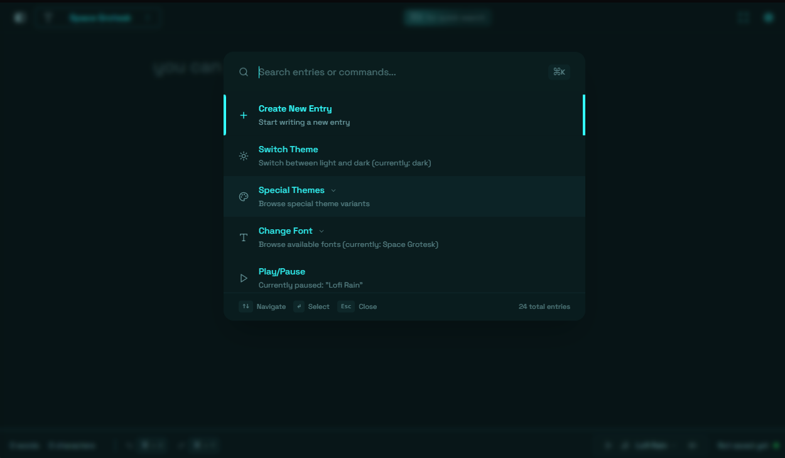

# /typein ✍️

<div align="center">
  
</div>

A minimalist writing app that lets you focus on what matters - your thoughts. No distractions, just you and your words. Perfect for daily journaling, quick notes, or getting those creative juices flowing.

## Features

- 🎨 Clean, distraction-free writing space
- 💾 Auto-saves everything you write
- 🌓 Light/Dark mode + 6 beautiful special themes
- 🔤 Multiple font choices with persistent settings
- 🎵 Ambient music player for the perfect writing mood
- 📱 Works great on all devices

## Try It Out

Visit [typein.space](https://typein.space) to start writing!

## Quick Start

```bash
# Install dependencies
npm install

# Run locally
npm run dev
```

## Made With ❤️

Built by [AK CHAVAN](https://github.com/iamakchavan)
